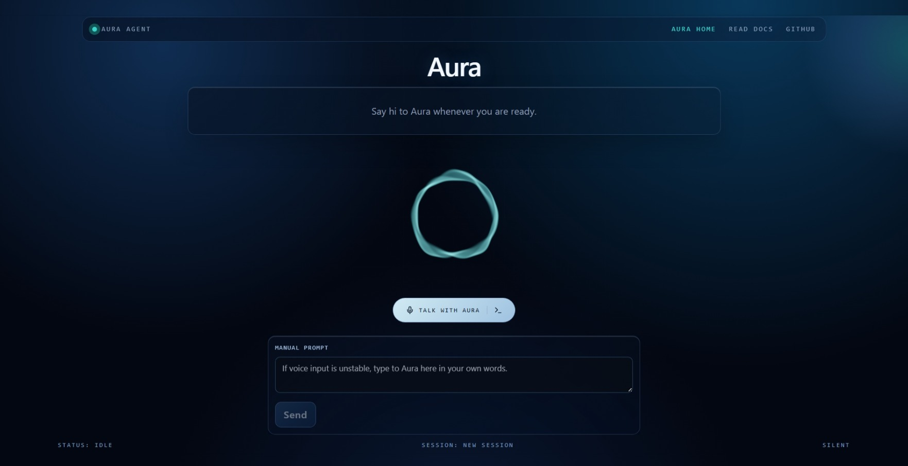

# Aura

Aura is a real-time voice assistant web app built with React + Express.

Architecture: Mic -> STT -> Backend -> LLM -> TTS -> Speaker

## Screenshot



## Features

- Voice-first interaction with speech-to-text and text-to-speech
- Live transcript and assistant response flow
- Session-based chat state across turns
- Modern responsive UI (phone, tablet, desktop)
- Manual text prompt fallback when voice is unavailable

## Tech Stack

- Frontend: React, Vite, Tailwind pipeline, Lucide icons
- Backend: Node.js, Express
- AI Provider: Hugging Face Inference API (OpenAI-compatible endpoint)

## Project Structure

```text
vapi/
  frontend/
    src/
      api/
      components/
      hooks/
      lib/
      App.jsx
  backend/
    src/
      config/
      controllers/
      routes/
      services/
      app.js
      server.js
  docs/
    images/
      aura-home.jpeg
```

## Prerequisites

- Node.js 18+
- npm 9+

## Setup

1. Install dependencies:

```bash
npm install
```

2. Create backend environment file:

```bash
cp backend/.env.example backend/.env
```

3. Configure required variables in `backend/.env`:

- `HUGGINGFACE_API_KEY` (required)
- `HUGGINGFACE_MODEL` (recommended: `Qwen/Qwen2.5-7B-Instruct`)
- `HUGGINGFACE_BASE_URL` (optional)

4. Run the app:

```bash
npm run dev
```

5. Open:

- Frontend: http://localhost:5173
- Backend: http://localhost:4000

## Available Scripts

- `npm run dev`: runs frontend + backend concurrently
- `npm run dev:frontend`: runs only frontend
- `npm run dev:backend`: runs only backend
- `npm run build`: builds frontend

## API

### `POST /api/chat`

Request:

```json
{
  "sessionId": "optional-session-id",
  "message": "Hello there"
}
```

Response:

```json
{
  "sessionId": "generated-or-passed-session-id",
  "reply": "Assistant response",
  "history": [
    { "role": "user", "content": "Hello there" },
    { "role": "assistant", "content": "Assistant response" }
  ]
}
```

## Notes

- Web Speech API support depends on browser capabilities (best in Chromium browsers).
- If Aura does not behave correctly in your current browser, switch to a different browser and test again.
- Session history currently uses in-memory storage. Use Redis or a database for production.
